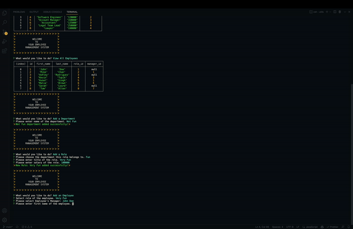

# Employee Tracker

  Command-line application that helps you mange employee's database.

  [](https://opensource.org/licenses/MIT)

---

## Contents 🗒

1. [About](#about)
    1. [User Story](#user%20story)
    2. [Acceptance criteria](#acceptance%20criteria)
    3. [Project Preview](#project%20preview)
2. [Installation](#installation)
3. [Technologies](#technologies)
4. [License](#license)
5. [Contributing](#contributing)
6. [Authors and acknowledgment](#authors%20and%20acknowledgment)
7. [Contacts](#contacts)

---

## About 📋

This is a simple back-end application built from scratch to help a small company manage their employee's database. You can add, update and delete employees, roles, and departments.

---

## User Story 👩🏻‍🏫

```md
AS A business owner
I WANT to be able to view and manage the departments, roles, and employees in my company
SO THAT I can organize and plan my business
```

---

## Acceptance Criteria 🌈

```md
GIVEN a command-line application that accepts user input
WHEN I start the application
THEN I am presented with the following options: view all departments, view all roles, view all employees, add a department, add a role, add an employee, and update an employee role
WHEN I choose to view all departments
THEN I am presented with a formatted table showing department names and department ids
WHEN I choose to view all roles
THEN I am presented with the job title, role id, the department that role belongs to, and the salary for that role
WHEN I choose to view all employees
THEN I am presented with a formatted table showing employee data, including employee ids, first names, last names, job titles, departments, salaries, and managers that the employees report to
WHEN I choose to add a department
THEN I am prompted to enter the name of the department and that department is added to the database
WHEN I choose to add a role
THEN I am prompted to enter the name, salary, and department for the role and that role is added to the database
WHEN I choose to add an employee
THEN I am prompted to enter the employee’s first name, last name, role, and manager, and that employee is added to the database
WHEN I choose to update an employee role
THEN I am prompted to select an employee to update and their new role and this information is updated in the database 
```

---

## Project Preview 📸




---

## Installation 📀

  Clone repo, run npm init, install dependencies, run node

  To clone the repo:

    git clone 
    
    git@github.com:vynguyen205/Employee-Tracker.git

---

## Technologies 👩🏻‍🔧

- JavaScript (Inquirer, Node.js and MySQL)

---

## License 👮🏻‍♀️

  License used for this project - MIT
  * For more information on license types, please reference this website
  for additional licensing information - [https: //choosealicense.com/](https://choosealicense.com/).

---

## Contributing 💃🏻

To contribute to this application, create a pull request.
  Here are the steps needed for doing that:
  - Fork the repo
  - Create a feature branch (git checkout -b NAME-HERE)
  - Commit your new feature (git commit -m 'Add some feature')
  - Push your branch (git push)
  - Create a new Pull Request
  Following a code review, your feature will be merged.

---

## Links 🔗 

**[GITHUB LINK 🐱](https://github.com/vynguyen205/Employee-Tracker)**

<br>

**[VIDEO DEMO 👀](https://youtu.be/jpsRByeQhgs)**

---

## Usage Instructions 💻

Once you clone the repo, please run the start.js file and not connection.js file.

---

## Authors and Acknowledgments ✨

Built by Vy Nguyen

---

## Contacts ☎️

- GitHub Username: [vynguyen205](https://github.com/vynguyen205)
- GitHub Email: vynguyen0520@gmail.com
  
